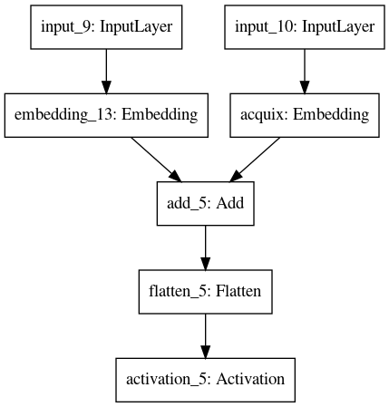

[](https://codecov.io/gh/jilljenn/ktm/)

# Knowledge Tracing Machines

- Presented at the AAAI 2019 conference in Honolulu, Hawaii on January 27, 2019 [[arXiv]](https://arxiv.org/abs/1811.03388) [[slides]](https://jiji.cat/slides/aaai2019-ktm-slides.pdf).
- Applied in the [Best Paper Award](https://arxiv.org/abs/1905.06873) of the EDM 2019 conference in Montreal, Canada on July 2, 2019.

```bibtex
@inproceedings{Vie2019,
  Author = {{Vie}, Jill-J{\^e}nn and {Kashima}, Hisashi},
  Booktitle = {Proceedings of the 33th {AAAI} Conference on Artificial Intelligence},
  Title = {{Knowledge Tracing Machines: Factorization Machines for Knowledge Tracing}},
  Pages = {750--757},
  Url = {https://arxiv.org/abs/1811.03388},
  Year = 2019
}
```

Authors: [Jill-Jênn Vie](https://jjv.ie), [Hisashi Kashima](https://hkashima.github.io/index_e.html)

## Follow our tutorial

Presented at the [Optimizing Human Learning](https://humanlearn.io) workshop in Kingston, Jamaica on June 4, 2019.

Slides from the tutorial are available [here](https://jjv.ie/slides/tuto.pdf). A Jupyter notebook will be available "soon" on Binder.

The tutorial makes you play with the models to assess **weak generalization**. To assess **strong generalization** and reproduce the experiments of the paper, you may want to use scikit-learn's [GroupShuffleSplit](https://scikit-learn.org/stable/modules/cross_validation.html#group-shuffle-split).

## Install

    python3 -m venv venv
    . venv/bin/activate
    pip install -r requirements.txt  # Will install numpy, scipy, pandas, scikit-learn, pywFM

If you also want to get the factorization machines running (KTM for *d* > 0), you should also do:

    make libfm

## Prepare data

Select a dataset and the features you want to include.

### Case 1: There is only one skill per item.

`data/<dataset>/data.csv` should contain the following columns:

    user, item, skill, correct, wins, fails

where wins and fails are the number of successful and unsuccessful
attempts at the corresponding skill.

### Case 2: There may be several skills associated to an item.

`data/<dataset>/needed.csv` needs to contain:

    user_id, item_id, correct

(Note the difference.)

And `data/<dataset>/q_mat.npz` should be a q-matrix under `scipy.sparse` format.

If you want to compute wins and fails like in PFA or DAS3H,
you should run `encode_tw.py` instead of this file, with the `--pfa` option for PFA or `--tw` for DAS3H.

## Running

### NEW! 2024 update: efficient scikit-learn implementation

Are you excited? If so, check <sktm.py>.

```python
pipe = Pipeline([
    ('onehot', OneHotEncoder(handle_unknown='ignore')),
    ('lr', LogisticRegression(solver='liblinear'))
])

# IRT
pipe.fit(df_train[['user', 'item']], df_train['correct'])
print(pipe.predict_proba(df_test[['user', 'item']]))

# PFA
pipe.fit(df_train[['skill', 'wins', 'fails']], df_train['correct'])
print(pipe.predict_proba(df_test[['skill', 'wins', 'fails']]))
```

sktm contains efficient parallel cross validation over 5 folds, stratified by group (i.e. strong generalization).

Usage:

    mkdir data/assistments09
    wget https://jiji.cat/weasel2018/data.csv -P data/assistments09
    python sktm.py --dataset assistments09 --model (irt|pfa|sktm)  # Choose which model

For factorization machines, replace `LogisticRegression` with `from fm import FMClassifier`.

### Available datasets

- [Assistments 2009](https://sites.google.com/site/assistmentsdata/home/2009-2010-assistment-data)
- Our [reformatted version of the Assistments 2009 dataset](https://jiji.cat/weasel2018/data.csv).
- Berkeley and Castor datasets are private.
- Datasets ECPE and TIMSS 2003 come from the [CDM package](https://alexanderrobitzsch.github.io/CDM/reference/):

```R
> install.packages('CDM')
> library('CDM')
> dim(fraction.subtraction.data)
[1] 536  20
> dim(data.ecpe$data)
[1] 2922   29
> dim(data.timss03.G8.su$data)
[1] 757  25
```

### Encoding data into sparse features (quick start)

    python encode.py --users --items  # To get the encodings (npz)
    python lr.py data/dummy/X-ui.npz  # To get results (txt)

You can also download the [Assistments 2009 dataset](https://jiji.cat/weasel2018/data.csv) into `data/assistments09` and change the dataset:

    python encode.py --dataset assistments09 --skills --wins --fails  # Will encode PFA sparse features into X-swf.npz

If you are lazy, you can also just do `make` and try to understand what is going on in the [Makefile](Makefile).

### Encoding time windows

Choffin et al. proposed the DAS3H model, and we implemented it using queues. This code is faster than the original KTM encoding.

To prepare a dataset like Assistments, see examples in the `data` folder.  
Skill information should be available either as `skill_id`, or `skill_ids` separated with `~~`, or in a q-matrix `q_mat.npz`.

    python encode_tw.py --dataset dummy_tw --tw  # Will encode DAS3H sparse features into X.npz

Then you can run `lr.py` or `fm.py`, see below.

### Running a ML model

If you want to encode PFA features:

    python encode.py --skills --wins --fails  # Will create X-swf.npz

For logistic regression:

    python lr.py data/dummy/X-swf.npz
	# Will save weights in coef0.npy

For factorization machines of size *d* = 5:

    python fm.py --d 5 data/dummy/X-swf.npz
	# Will save weights in w.npy and V.npy

The following code does not work if you don't have user_id as column in CSV file.

NEW! For an online MIRT model:

    python omirt.py --d 0 data/assist09/needed.csv  # Will load LR: coef0.npy
	python omirt.py --d 5 data/assist09/needed.csv  # Will load FM: w.npy and V.npy

	# Will train a IRT model on Fraction dataset with learning rate 0.01
	python omirt.py --d 0 data/fraction/needed.csv --lr 0.01 --lr2 0.

NEW! For an IRT or deeper model with Keras, for batching and early stopping:

    python dmirt.py data/assist09/needed.csv

It will also create a model.png file with the architecture (here just IRT with L2 regularization):



## Results

### Weak generalization

Those numbers may change according to your random state seed.

On the Assistments 2009 dataset:

| AUC time    | users + items  | skills + wins + fails | items + skills + wins + fails |
|:------------|:---------------|:----------------------|:------------------------------|
| LR          | **0.734** (IRT) 2s | 0.651 (PFA) 9s        | 0.737 23s                     |
| FM *d* = 20 | 0.730 2min9s   | **0.652** 43s             | **0.739** 2min30s                 |

Computation times are given for a i7 with 2.6 GHz, with 200 epochs of FM training.

### Strong generalization

On the Assistments 2009 dataset:

| Model | Dimension | AUC | Improvement |
|:-----:|:---------:|:---:|:-----------:|
| KTM: items, skills, wins, fails, extra | 5 | **0.819** | |
| KTM: items, skills, wins, fails, extra | 5 | 0.815 | +0.05 |
| KTM: items, skills, wins, fails | 10 | 0.767 | |
| KTM: items, skills, wins, fails | 0 | 0.759 | +0.02 |
| (*DKT* (Wilson et al., 2016)) | 100 | 0.743 | +0.05 |
| IRT: users, items | 0 | 0.691 | |
| PFA: skills, wins, fails | 0 | 0.685 | +0.07 |
| AFM: skills, attempts | 0 | 0.616 | |

On the [Duolingo](http://sharedtask.duolingo.com) French dataset:

| Model | Dimension | AUC | Improvement |
|:-----:|:---------:|:---:|:-----------:|
| KTM   | 20        | **0.822** | +0.01 |
| DeepFM | 20       | 0.814 | +0.04 |
| Logistic regression + L2 reg | 0 | 0.771 |

We also showed that Knowledge Tracing Machines (Bayesian FMs) got better results than Deep Factorization Machines on the [Duolingo dataset](http://sharedtask.duolingo.com). See our article: [Deep Factorization Machines for Knowledge Tracing](https://arxiv.org/abs/1805.00356) and [poster](https://github.com/jilljenn/ktm/blob/master/poster/dfm-kt-poster.pdf) at the [BEA](https://www.cs.rochester.edu/~tetreaul/naacl-bea13.html) workshop at New Orleans, LA on June 5, 2018.

    @inproceedings{Vie2018,
      Author = {{Vie}, Jill-J{\^e}nn},
      Booktitle = {{Proceedings of the Thirteenth Workshop on Innovative Use of NLP for Building Educational Applications}},
      Pages = {370--373},
      Title = {{Deep Factorization Machines for Knowledge Tracing}},
      Url = {http://arxiv.org/abs/1805.00356},
      Year = 2018}
